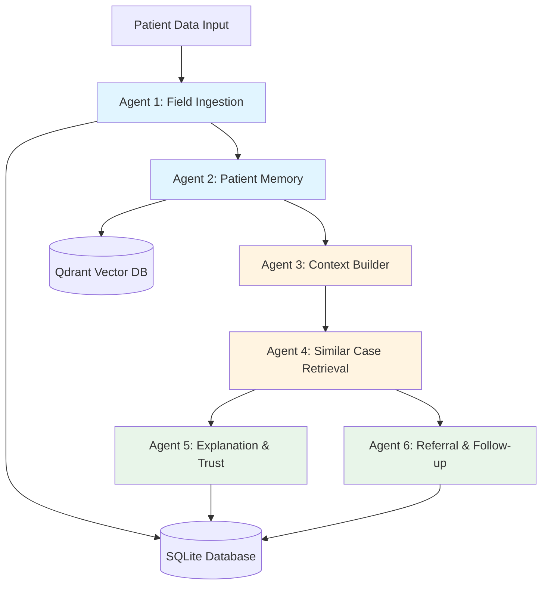

# Rural Healthcare AI Memory Assistant

An advanced **multi-agent AI system** designed to help healthcare workers in rural settings by processing multimodal patient data, maintaining longitudinal patient memory, and retrieving similar historical cases to support clinical decision-making.

## Overview

This system combines **6 specialized AI agents** in a LangGraph pipeline to:
- **Ingest multimodal patient data** (text, audio, images, documents)
- **Assess data quality** and tag uncertainty
- **Store patient context** in a vector database (Qdrant)
- **Retrieve similar historical cases** using hybrid search
- **Generate explanations** with safety constraints
- **Detect follow-up gaps** and provide care nudges

The system is designed for **offline-capable**, **deterministic**, and **inspectable** healthcare workflows in resource-constrained environments.

---

## System Architecture



### Data Flow
1. **Ingestion** → Multimodal data processed with quality assessment
2. **Memory** → Embeddings generated and stored in Qdrant
3. **Planning** → Retrieval constraints built from patient history
4. **Retrieval** → Hybrid search for similar cases
5. **Explanation** → LLM-powered, safety-constrained explanations
6. **Follow-up** → Deterministic gap detection and nudges

---

## Agent Components

### Agent 1: Field Ingestion Agent
**Purpose**: Process and validate multimodal patient data

**Capabilities**:
- **Text processing**: Normalize clinical notes, detect sparse input
- **Audio transcription**: Whisper-based transcription with language detection
- **Image quality assessment**: Blur detection, resolution checks
- **Document OCR**: Tesseract-based text extraction with confidence scoring
- **Uncertainty tagging**: Flag low-quality or incomplete data

**Output**: Canonical `patient_data` JSON with quality metadata

**Files**: [`my_code/agents.py`](file:///d:/convolve/Convolve-4.0-Submission-2Slow2Serious/my_code/agents.py)

---

### Agent 2: Patient Memory Agent
**Purpose**: Store patient events in vector database and generate current state summaries

**Capabilities**:
- **Multimodal embedding generation**: Text (Sentence-BERT), images (CLIP), audio (CLAP)
- **Qdrant integration**: Write events to `patient_context_events_v1` collection
- **Patient history retrieval**: Fetch all events for a patient
- **Current state summarization**: Aggregate visits, uncertainty flags, recurring themes

**Output**: `patient_current_state` with longitudinal summary

**Files**: [`my_code/patient_memory_agent.py`](file:///d:/convolve/Convolve-4.0-Submission-2Slow2Serious/my_code/patient_memory_agent.py), [`my_code/embeddings.py`](file:///d:/convolve/Convolve-4.0-Submission-2Slow2Serious/my_code/embeddings.py)

---

### Agent 3: Context Builder Agent
**Purpose**: Build retrieval plan with safety constraints

**Capabilities**:
- **Signal extraction**: Deterministic extraction of program type, pregnancy status, age, geography
- **Constraint building**: Safety-critical filters for retrieval (no cross-program leakage)
- **Modality policy**: Disable unreliable modalities based on uncertainty flags
- **Risk flagging**: Identify data quality issues

**Output**: `retrieval_plan` with hard constraints and soft signals

**Files**: [`my_code/context_builder_agent.py`](file:///d:/convolve/Convolve-4.0-Submission-2Slow2Serious/my_code/context_builder_agent.py)

---

### Agent 4: Similar Case Retrieval Agent
**Purpose**: Retrieve similar historical cases using hybrid search

**Capabilities**:
- **Dense vector search**: Semantic similarity using patient embeddings
- **Sparse keyword search**: Fallback keyword matching
- **Hybrid merging**: Combine and re-rank results
- **Safety filtering**: Apply payload filters (program, pregnancy, age, geography)
- **Deterministic scoring**: Weighted scoring with transparency

**Output**: `retrieved_cases` with similarity scores and metadata

**Files**: [`my_code/similar_case_retrieval_agent.py`](file:///d:/convolve/Convolve-4.0-Submission-2Slow2Serious/my_code/similar_case_retrieval_agent.py)

---

### Agent 5: Explanation & Trust Agent
**Purpose**: Generate human-readable explanations using LLM (Gemini)

**Capabilities**:
- **Constrained LLM prompting**: No diagnosis, no medical advice, cite uncertainty
- **Evidence-based explanations**: Show counts of similar cases and confidence levels
- **Fallback logic**: Basic template-based explanation if LLM fails

**Output**: `explanation_text` with safety-compliant narrative

**Files**: [`my_code/explanation_and_referral_agents.py`](file:///d:/convolve/Convolve-4.0-Submission-2Slow2Serious/my_code/explanation_and_referral_agents.py)

---

### Agent 6: Referral & Follow-up Agent
**Purpose**: Detect care gaps and generate follow-up nudges

**Capabilities**:
- **Follow-up gap detection**: Identify overdue visits (>14 days)
- **High-risk flagging**: Urgent cases (>7 days for high-risk patients)
- **Nudge generation**: Actionable recommendations for care teams
- **Deterministic logic**: No LLM, pure code-based rules

**Output**: `followup_output` with status and nudges

**Files**: [`my_code/explanation_and_referral_agents.py`](file:///d:/convolve/Convolve-4.0-Submission-2Slow2Serious/my_code/explanation_and_referral_agents.py)

---

## 🗄️ Database Schema

### SQLite Database (`ingestion.db`)

**Tables**:

| Table | Purpose |
|-------|---------|
| `raw_interactions` | Store raw uploaded files and metadata |
| `processed_interactions` | Store canonical `patient_data` JSON |
| `patient_states` | Store `patient_current_state` from Agent 2 |
| `retrieval_plans` | Store retrieval plans from Agent 3 |
| `retrieval_results` | Store retrieved cases from Agent 4 |
| `final_outputs` | Store explanations and follow-up outputs |

**Files**: [`my_code/db.py`](file:///d:/convolve/Convolve-4.0-Submission-2Slow2Serious/my_code/db.py)

---

### Qdrant Vector Database

**Collection**: `patient_context_events_v1`

**Vectors**:
- `text_embedding` (384-dim, Sentence-BERT)
- `image_embedding` (512-dim, CLIP) - *optional*
- `audio_embedding` (512-dim, CLAP) - *optional*

**Payload** (stored metadata):
```json
{
  "patient_hash": "...",
  "event_id": "...",
  "timestamp": 1234567890,
  "text_summary": "...",
  "program_type": "dermatology",
  "is_pregnant": false,
  "age_bracket": "30-40",
  "geography": "rural_rajasthan",
  "uncertainty_flags": {...}
}
```

**Files**: [`my_code/qdrant_manager.py`](file:///d:/convolve/Convolve-4.0-Submission-2Slow2Serious/my_code/qdrant_manager.py)

---

## 🔌 API Documentation

### FastAPI Backend

**Start server**:
```bash
cd my_code
python api.py
# Server runs at http://localhost:8000
```

### Endpoints

#### `POST /process`
Process multimodal patient data through the full agent pipeline.

**Request** (multipart form data):
- `patient_hash` (required): Anonymized patient identifier
- `text_notes` (optional): Clinical notes
- `audio` (optional): Audio file
- `images` (optional): List of image files
- `documents` (optional): List of document files
- `device_id` (optional): Device identifier
- `offline` (optional): Offline mode flag

**Response**:
```json
{
  "success": true,
  "interaction_id": "...",
  "patient_data": {...},
  "event_id": "...",
  "patient_current_state": {...},
  "retrieval_plan": {...},
  "retrieved_cases": [...],
  "explanation_text": "...",
  "followup_output": {...},
  "logs": ["..."],
  "processing_time_ms": 1234
}
```

#### `GET /health`
Health check endpoint.

#### `GET /interactions/{interaction_id}`
Retrieve a specific interaction by ID.

#### `GET /interactions`
List recent processed interactions (default limit: 20).

#### `GET /stats`
Get database statistics (interaction counts, uncertainty flags).

**Files**: [`my_code/api.py`](file:///d:/convolve/Convolve-4.0-Submission-2Slow2Serious/my_code/api.py)

---

## 🛠️ Setup Instructions

### Prerequisites
- **Python 3.8+**
- **Qdrant instance** (cloud or self-hosted)
- **Google Gemini API key** (for Agent 5)

### 1. Clone Repository
```bash
git clone <repository-url>
cd Convolve-4.0-Submission-2Slow2Serious
```

### 2. Create Virtual Environment
```bash
python -m venv myenv

# Windows
myenv\Scripts\activate

# macOS/Linux
source myenv/bin/activate
```

### 3. Install Dependencies
```bash
cd my_code
pip install -r requirements.txt
```

**Optional dependencies** (uncomment in `requirements.txt` if needed):
- `openai-whisper` - Audio transcription
- `pytesseract` - OCR (requires system Tesseract installation)
- `PyMuPDF` - PDF processing
- `laion-clap` - Audio embeddings

### 4. Configure Environment Variables

Create a `.env` file in the **root directory**:

```env
# Qdrant Configuration (REQUIRED)
QDRANT_URL=https://your-qdrant-instance.qdrant.io
QDRANT_API_KEY=your_qdrant_api_key

# Google Gemini API (REQUIRED for Agent 5)
GEMINI_API_KEY=your_gemini_api_key
```

### 5. Initialize Databases

The SQLite database will be created automatically on first run. To verify:

```bash
cd my_code
python check_db.py
```

For Qdrant, ensure your instance is running and accessible.

### 6. (Optional) Load Sample Patient Data

```bash
python bulk_load_data.py
```

This loads synthetic patient cases into Qdrant for testing.

---

## Running the System

### Option 1: Full FastAPI Backend
Start the complete system with web interface:

```bash
cd my_code
python api.py
```

Open http://localhost:8000 in your browser.

### Option 2: Run 3-Agent Pipeline (Demo)
Test the first 3 agents (Ingestion + Memory + Context Builder):

```bash
cd my_code
python three_agent_pipeline.py
```

### Option 3: Run Individual Agents
For development and testing:

```python
from my_code.agents import field_ingestion_agent
from my_code.patient_memory_agent import patient_memory_agent

# Agent 1
state = {
    "patient_hash": "demo_patient",
    "raw_text": "Patient has skin rash on arms. Itching reported."
}
result = field_ingestion_agent(state)

# Agent 2
result_2 = patient_memory_agent({"patient_data": result["patient_data"]})
```

---

## Project Structure

```
Convolve-4.0-Submission-2Slow2Serious/
├── my_code/                          # Core agent implementations
│   ├── agents.py                     # Agent 1: Field Ingestion
│   ├── patient_memory_agent.py       # Agent 2: Patient Memory
│   ├── context_builder_agent.py      # Agent 3: Context Builder
│   ├── similar_case_retrieval_agent.py  # Agent 4: Similar Case Retrieval
│   ├── explanation_and_referral_agents.py  # Agents 5 & 6
│   ├── db.py                         # SQLite database layer
│   ├── qdrant_manager.py             # Qdrant client wrapper
│   ├── embeddings.py                 # Multimodal embedding generation
│   ├── api.py                        # FastAPI backend
│   ├── three_agent_pipeline.py       # 3-agent demo pipeline
│   ├── langgraph_integration.py      # LangGraph integration
│   ├── requirements.txt              # Python dependencies
│   └── static/                       # Frontend assets
├── data/                             # Patient data and synthetic cases
│   ├── patient_data/                 # 25 synthetic patient JSON files
│   ├── text/                         # Text data
│   ├── images/                       # Image data
│   └── generate_data.py             # Synthetic data generator
├── uploads/                          # User-uploaded files (created at runtime)
├── artifacts/                        # Generated artifacts
├── app.py                            # Legacy Streamlit demo (deprecated)
├── ingestion.db                      # SQLite database (created at runtime)
├── requirements.txt                  # Top-level dependencies
├── .env                              # Environment variables (create this)
├── .gitignore                        # Git ignore rules
└── README.md                         # This file
```

---

## Technology Stack

### Core Framework
- **FastAPI** - RESTful API backend
- **Uvicorn** - ASGI server
- **Pydantic** - Data validation

### AI & Machine Learning
- **Sentence Transformers** - Text embeddings (all-MiniLM-L6-v2)
- **CLIP** - Image embeddings (ViT-B/32)
- **Whisper** - Audio transcription (OpenAI)
- **Google Gemini** - LLM for explanations
- **PyTorch** - Deep learning framework

### Vector Database
- **Qdrant** - Vector similarity search

### Data Processing
- **Pillow** - Image processing
- **NumPy, SciPy** - Numerical operations
- **Tesseract** - OCR (optional)
- **PyMuPDF** - PDF processing (optional)

### Storage
- **SQLite** - Relational database for structured data

---

## Usage Examples

### Example 1: Process Patient Data via API

```bash
curl -X POST http://localhost:8000/process \
  -F "patient_hash=patient_123" \
  -F "text_notes=Patient reports itching and rash on arms." \
  -F "images=@lesion_photo.jpg"
```

### Example 2: Run 3-Agent Pipeline Programmatically

```python
from my_code.three_agent_pipeline import run_three_agent_pipeline

result = run_three_agent_pipeline(
    patient_hash="demo_patient_001",
    raw_text="Patient has skin rash on arms. Itching reported. No fever.",
    image_paths=["./uploads/lesion1.jpg"]
)

print(f"Event ID: {result['event_id']}")
print(f"Total Visits: {result['patient_current_state']['total_visits']}")
print(f"Retrieval Plan: {result['retrieval_plan']}")
```

### Example 3: Query Patient Memory Directly

```python
from my_code.qdrant_manager import QdrantManager

qm = QdrantManager()
history = qm.get_patient_history("patient_123", limit=5)

for event in history:
    print(f"Visit on {event['timestamp']}: {event['text_summary']}")
```

---

## Security & Privacy

- **Patient anonymization**: All patient identifiers are hashed
- **Offline capability**: System works without internet (except for LLM calls)
- **Data isolation**: SQLite and Qdrant ensure proper data separation
- **Safety constraints**: Agents never provide medical diagnosis or advice

---

## Testing

Run the health check:
```bash
curl http://localhost:8000/health
```

Test with sample data:
```bash
cd my_code
python three_agent_pipeline.py
```
